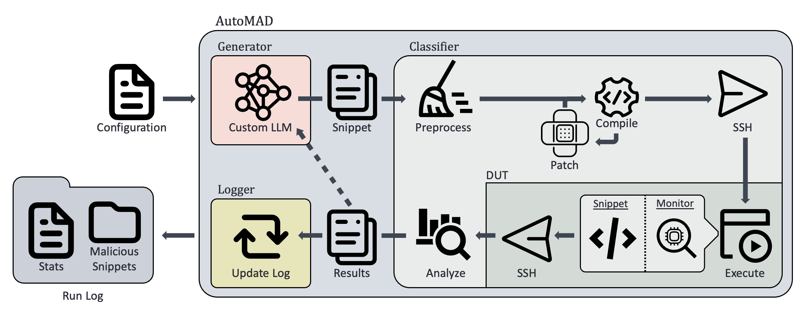

# AutoMAD: Leveraging Large Language Models for Automated Microarchitectural Attack Discovery

AutoMAD is an open-source architectural fuzzer. In order to run AutoMAD it is necessary to have a computer capable of running a small Large Language Model (LLM) and a ARMv8 computer with a built in power monitor (e.g. an INA3221 found in the Nvidia Jetson AGX Orin). It is recommended to have a GPU with the necessary CUDA drivers, otherwise performance will be negatively affected.

## Abstract

Microarchitectural attacks exploit shared hardware resources, posing a significant threat to cloud computing, a multi-billion-dollar industry widely adopted for data management and workload processing. Additionally, while ARM processors are increasingly used in both desktop and server environments, they have not undergone the same security scrutiny as x86 systems. Despite their threat, there are no efficient and scalable methods for discovering these attacks. 

This work presents AutoMAD, an automated framework for discovering microarchitectural attacks on ARM systems. AutoMAD combines a Large Language Model (LLM) with a novel preprocessing algorithm to generate guided test code, addressing a key limitation in prior research. The generated code is executed on the target device while power is monitored. Using peak-to-peak current measurements as a reinforcement learning reward signal, AutoMAD iteratively refines its code generation to incentivise potential fault inducing code.

The experiments conducted demonstrate that AutoMAD successfully discovers code sequences that induce large, rapid power oscillation. The top performing of which far exceeded those produced by benign workloads (tested using Stress, MLucas, and the SPEC2006 benchmark suite). These findings confirm that AutoMAD can effectively identify conditions conducive to fault injection attacks on ARM processors.

As an open-source tool, AutoMAD provides a foundation for extending automated vulnerability discovery to other architectures and attack vectors. Its success highlights the potential of LLM-guided fuzzing as a scalable solution for securing next-generation hardware.


*Fig. 1 AutoMAD Block Diagram*

## How to Set Up

### Package Dependencies

AutoMAD needs to cross compile for an ARMv8 computer, as such it is necessary to have `aarch64-linux-gnu-gcc`. Additionally, `Python >= 3.10` is required. You can install these package by executing:
```
sudo apt install python3 gcc-aarch64-linux-gnu
```

### Python Dependencies

AutoMAD requires the Python libraries that are listed in `requirements.txt`. You can install those libraries by executing:
```
pip3 install -r requirements.txt --user
```

## How to Run AutoMAD

AutoMAD is configured entirely using `json` files. All configuration options can be found in `configs/automad.json`, addtionally this lists all default parameters. For only the necessary configuration options please see `configs/automad_reduced.json`. Descriptions of all parameters can be found at `configs/README.md`. A secondary configuration file is needed to set up current measurements, an example of this can be found at `configs/measure.xml`.

Once your configuration files are set up, AutoMAD can be launched using the following command:
```
python3 automad.py /path/to/config
```

Additionally, there is a demo version of AutoMAD that displays some of the interal process. This will be displayed in a text file named `demo` which will be created in your current directory. At the end of every run, the first 300 current measurments will be plotted and saved at `currents.png`. The demo can be run by executing the following command:
```
python3 demo.py /path/to/config
```

**NOTE:** The demo was made to be run with a batch size of 1, so the demo configuration file needs to have `"generator_kwargs" : {"batch_size" : 1}`.